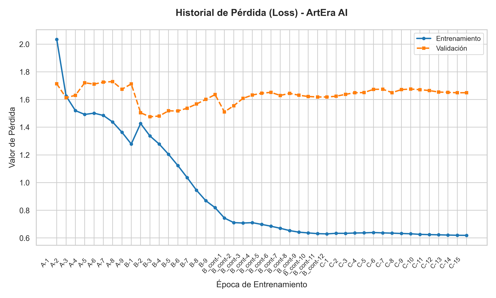
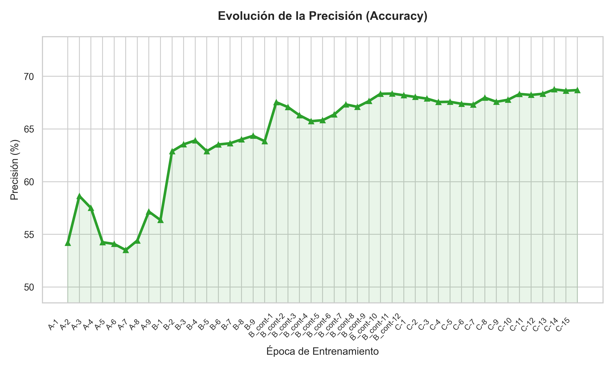
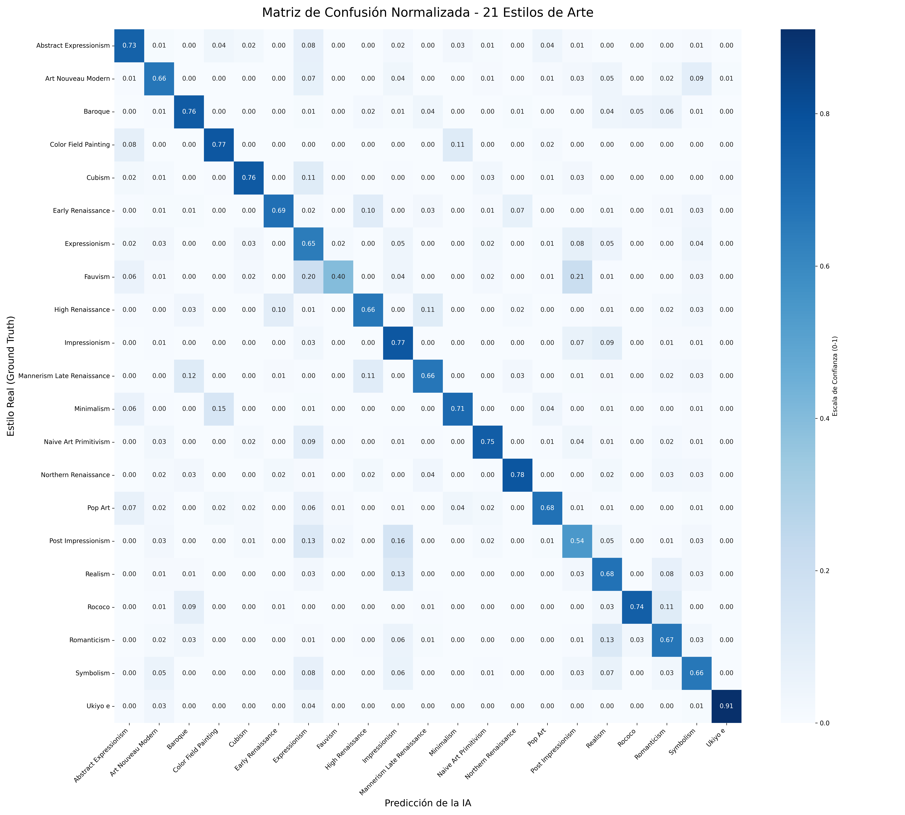

# 🎨 ArtEra Style: Art Movement Classifier

**ArtEra Style** is a state-of-the-art computer vision project designed to identify and classify **21 distinct artistic movements**. Using a fine-tuned **ConvNeXt-Tiny** architecture, the model analyzes both the structural composition of a painting and the intricate micro-textures of brushstrokes to provide high-accuracy predictions.

---

## 🔗 Project Ecosystem

The model and its optimized training data are hosted on Hugging Face for easy access and reproducibility:

| Component | Badge |
| :--- | :--- |
| **Trained Model** | [](https://huggingface.co/michaelrodcs/art-style-convnext) |
| **Optimized Dataset** | [](https://huggingface.co/datasets/michaelrodcs/wikiart-21-styles-optimized) |

---

## 🚀 Training Strategy: Bag of Tricks & Progressive High-Resolution

To achieve robust convergence and handle the extreme stylistic variance in art, I implemented a modern training regimen utilizing advanced data augmentation and a **Progressive Resizing Strategy**:

1.  **Phase 1 - V2 Base (256px):** Initial robust training using a modern "Bag of Tricks". This phase utilized **Mixup** and **CutMix** (60% probability) to teach the model to recognize local brushstroke textures rather than just memorizing global compositions. Gradient Accumulation was used to simulate larger batch sizes on constrained VRAM.
2.  **Phase 2 - V3-HD Fine-Tuning (384px):** A final high-resolution polish phase. By increasing the input resolution by 125% and dropping the learning rate, the model learned to extract high-frequency features and disambiguate micro-textures, separating visually similar styles.

---

## 📊 Performance & Results

The final V3-HD model achieved a **Top-1 Validation Accuracy of 71.83%**, a highly competitive metric for a 21-class fine-grained art classification task involving 76k+ images.

### Training Metrics
| Loss History (Convergence) | Accuracy Growth |
| :---: | :---: |
|  |  |

### Confusion Matrix Analysis
The model excels at identifying styles with strong geometric, highly stylized, or unique cultural signatures. For instance, **Ukiyo-e** reached **91% accuracy** and **Art Nouveau Modern** hit **86%**.



> **Historical Insight:** The model shows semantic ambiguity between *Fauvism*, *Expressionism*, and *Post-Impressionism* (e.g., Fauvism overlaps 20% with Expressionism). Rather than a failure, this mirrors the actual artistic evolution of the late 19th and early 20th centuries, where these movements heavily shared unnatural color palettes and aggressive brushstroke techniques.

---

## 🛠️ Technical Stack

* **Framework:** PyTorch & Torchvision.
* **Architecture:** ConvNeXt-Tiny (Pre-trained on ImageNet-1K).
* **Dataset:** Custom curated and cleaned version of WikiArt (76k+ images).
* **Optimization:** AdamW with OneCycleLR Scheduler & Label Smoothing.
* **Augmentation:** TrivialAugmentWide, Mixup, CutMix, RandomResizedCrop.
* **Deployment Ready:** Integrated with Hugging Face Hub for cloud-based inference.

---

## 📦 Installation & Setup

1.  **Clone the repository:**
    ```bash
    git clone [https://github.com/michaelrodcs/art-era-style.git](https://github.com/michaelrodcs/art-era-style.git)
    cd art-era-style
    ```

2.  **Set up the environment:**
    ```bash
    pip install -r requirements.txt
    ```

3.  **Run Inference (Local):**
    ```bash
    python src/predict.py --image path/to/art.jpg
    ```

**Developed by michaelrodcs**