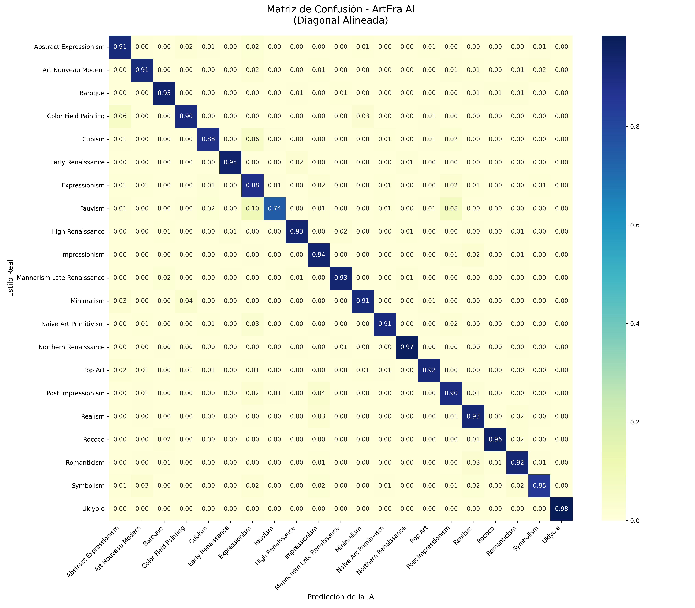

# 🎨 ArtEra Style: Art Movement Classifier

**ArtEra Style** is a state-of-the-art computer vision project designed to identify and classify **21 distinct artistic movements**. Using a fine-tuned **ConvNeXt-Tiny** architecture, the model analyzes both the structural composition of a painting and the intricate micro-textures of brushstrokes to provide high-accuracy predictions.

---

## 🔗 Project Ecosystem

The model and its optimized training data are hosted on Hugging Face for easy access and reproducibility:

| Component | Badge |
| :--- | :--- |
| **Trained Model** | [](https://huggingface.co/michaelrodcs/art-style-convnext) |
| **Optimized Dataset** | [](https://huggingface.co/datasets/michaelrodcs/wikiart-21-styles-optimized) |

---

## 🚀 Training Strategy: Progressive Resolution

To achieve a robust convergence and handle the high stylistic variance in art, I implemented a **Progressive Resizing Strategy** across three distinct phases:

1.  **Phase A (128px):** Initial training focused on capturing global shapes, color palettes, and basic spatial arrangements.
2.  **Phase B (224px):** Fine-tuning at standard resolution to refine stylistic patterns and lighting effects.
3.  **Phase C (256px):** Final polish phase to extract high-frequency features like brushstroke micro-textures and fine artist-specific details.

---

## 📊 Performance & Results

The final model achieved a **Top-1 Validation Accuracy of 68.76%**, which is highly competitive for a 21-class fine-grained art classification task.

### Training Metrics
| Loss History (Convergence) | Accuracy Growth |
| :---: | :---: |
|  |  |

### Confusion Matrix Analysis
The model excels at identifying styles with strong geometric or high-contrast signatures. For instance, **Cubism** reached **91% accuracy** and **Pop Art** hit **90%**.



> **Insight:** The model shows a slight historical ambiguity between *Realism* and *Impressionism*, mirroring the actual artistic transition between these movements in the late 19th century.

---

## 🛠️ Technical Stack

* **Framework:** PyTorch & Torchvision.
* **Architecture:** ConvNeXt-Tiny (Pre-trained on ImageNet-1K).
* **Dataset:** Custom curated version of WikiArt (76k+ images).
* **Optimization:** AdamW with Cosine Annealing Learning Rate Scheduler.
* **Deployment Ready:** Integrated with Hugging Face Hub for cloud-based inference.

---

## 📦 Installation & Setup

1.  **Clone the repository:**
    ```bash
    git clone [https://github.com/michaelrodcs/art-era-style.git](https://github.com/michaelrodcs/art-era-style.git)
    cd art-era-style
    ```

2.  **Set up the environment:**
    ```bash
    pip install -r requirements.txt
    ```

3.  **Run Inference (Local):**
    ```bash
    python src/predict.py --image path/to/art.jpg
    ```


**Developed by michaelrodcs** 